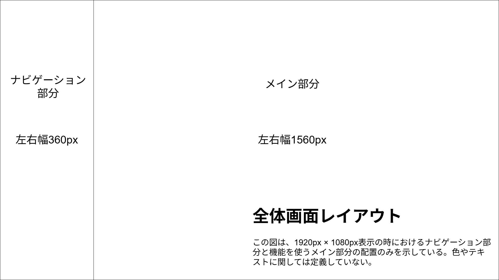

# 1. 制作物の定義

## 名称
- 日本語：道具箱サイト
- 英語：tool-box-site

## 概要
パスワード生成、特定の計算など、日常のパソコン作業を便利にする機能を多数提供するwebサイト

## 機能一覧
[機能一覧](./02_features_list.md)を参照

## 使用技術
- 言語：TypeScript
- ランタイム：Node.js
- フレームワーク：Next.js
- UI：Material UI
- DB：MongoDB
- デプロイ：Vercel（freeプラン）

## 画面構成
- 1画面で完結する
- ナビゲーション部分と、機能を使うメイン部分がある
- ナビゲーション部分は以下の項目を持つ
  - トップページ（機能を持たない空白のページ）への遷移リンク
  - [機能一覧](./02_features_list.md)にある各機能に遷移するリンク
- 全体画面レイアウトを以下に示す。この図は、1920px × 1080px表示の時におけるナビゲーション部分と機能を使うメイン部分の配置のみを示している。色やテキストに関しては定義していない。
  
